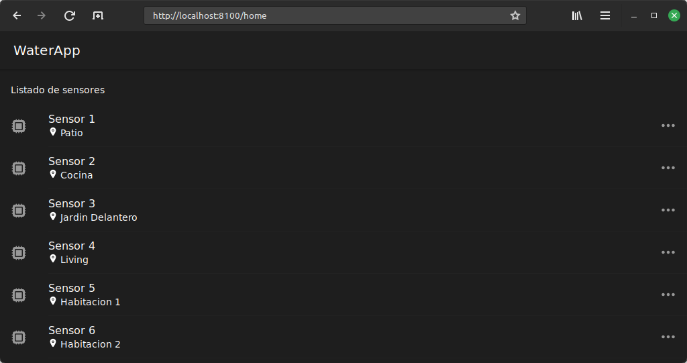
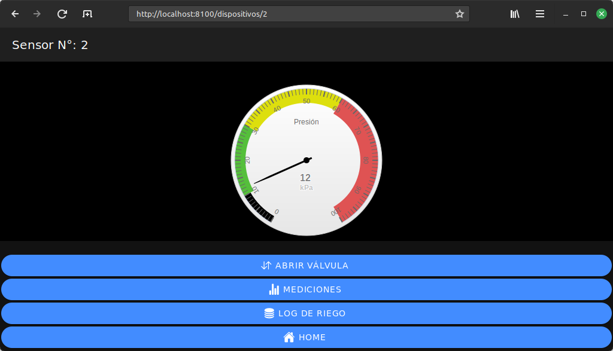
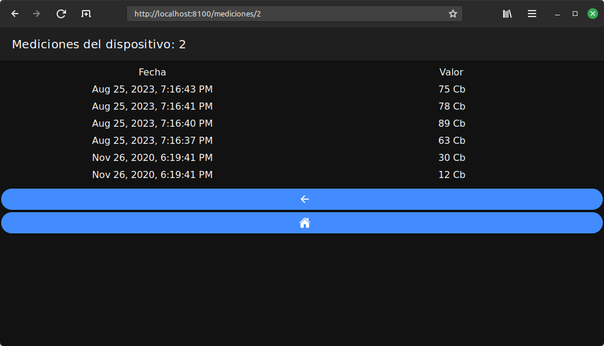
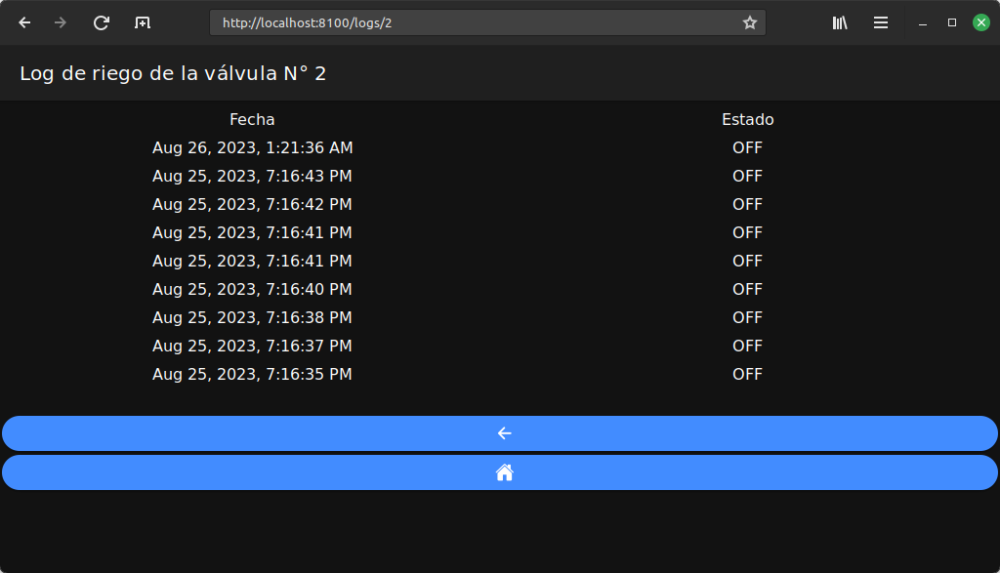

Web App Full Stack Base - Ionic frontend
========================================
Trabajo práctico final para la materia Desarrollo de Aplicaciones Multiplataforma de la carrera de especialización en IoT de la FIUBA, realizado por la Ing. Alena Grebneva.
El trabajo está realizado en el entorno Docker y está hecho a partir del repositorio [App Full Stack Base](https://github.com/PedroRosito/DAM/tree/8Co/app-fullstack-base-2022-i07).

En esta extensión del proyecto se utiliza el framework ionic para realizar el frontend.

## Comenzando 🚀

Esta sección es una guía con los pasos esenciales para que puedas poner en marcha la aplicación.

### Instalar las dependencias

Para correr este proyecto es necesario que instales `Docker` y `Docker Compose`. 

En [este artículo](https://www.gotoiot.com/pages/articles/docker_installation_linux/) publicado en nuestra web están los detalles para instalar Docker y Docker Compose en una máquina Linux. Si querés instalar ambas herramientas en una Raspberry Pi podés seguir [este artículo](https://www.gotoiot.com/pages/articles/rpi_docker_installation) de nuestra web que te muestra todos los pasos necesarios.

En caso que quieras instalar las herramientas en otra plataforma o tengas algún incoveniente, podes leer la documentación oficial de [Docker](https://docs.docker.com/get-docker/) y también la de [Docker Compose](https://docs.docker.com/compose/install/).

Continua con la descarga del código cuando tengas las dependencias instaladas y funcionando.

### Ejecución de la aplicación

Para ejecutar la aplicación, debes ejecutar el comando `docker compose up` desde la raíz del proyecto.

Para iniciar el proyecto de Angular/Ionic, ejecuta el comando `ng serve` en el directorio `'/src/frontend/dam'`.

Nota importante: si da un error por la instalación de Angular se debe ejecutar el comando `sudo npm install`. En algunas ocasiones, es posible que necesites usar privilegios de superusuario con `sudo ng serve`.

Para acceder al cliente web, abre la URL [http://localhost:8100/home](http://localhost:8100/home) en tu navegador.

> Si encuentras un error la primera vez que ejecutas la aplicación, detén el proceso y vuelve a iniciarlo. Esto se debe a que el backend espera que la base de datos esté creada al inicio, y en la primera ejecución es posible que no se haya creado a tiempo. A partir de la segunda ejecución, este problema se solucionará.

### Pantallas de la aplicación

Pantalla principal:

Pantalla del medidor correspondiente al sensor:

Log de mediciones:

Log de riego riego:

### Requerimientos de la aplicación

- Dos directivas estructurales: `ngFor` para el listado de dispositivos y `ngIf` para ocultar y mostrar los dispositivos.
- Una directiva de atributo: para cambiar el color del fondo de la lista de riego cuando el mouse pasa sobre los elementos.
- Un pipe personalizado: para mostrar la unidad de medida de presión en función del valor de la galga.
- Un servicio para conectarse a la API: se utiliza un servicio para gestionar cada tabla y el listado.
- Una API Express con comunicación a la base de datos.

## Licencia 📄

Este proyecto está bajo Licencia ([MIT](https://choosealicense.com/licenses/mit/)). Podés ver el archivo [LICENSE.md](LICENSE.md) para más detalles sobre el uso de este material.
